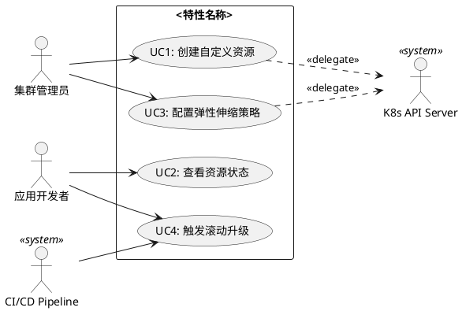
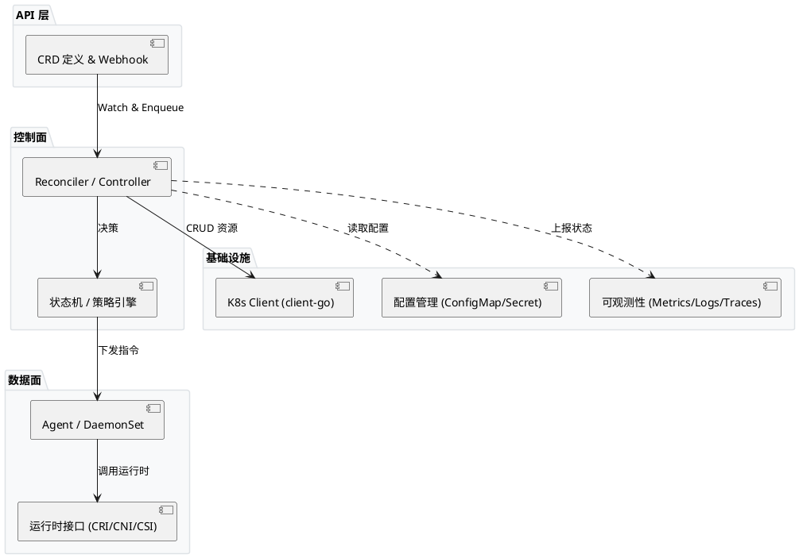
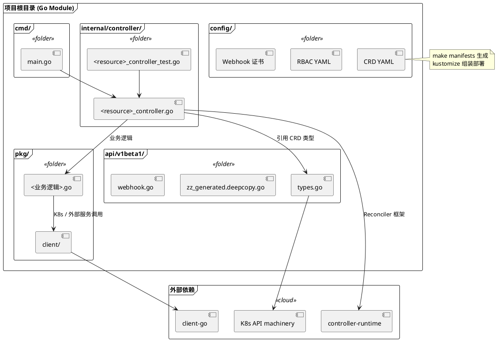
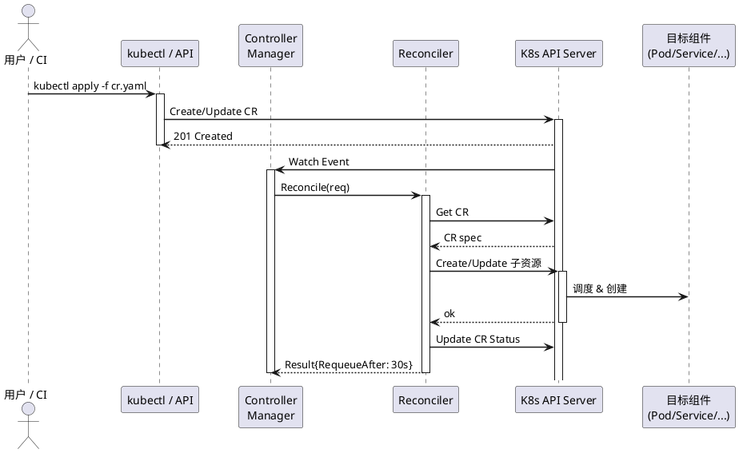
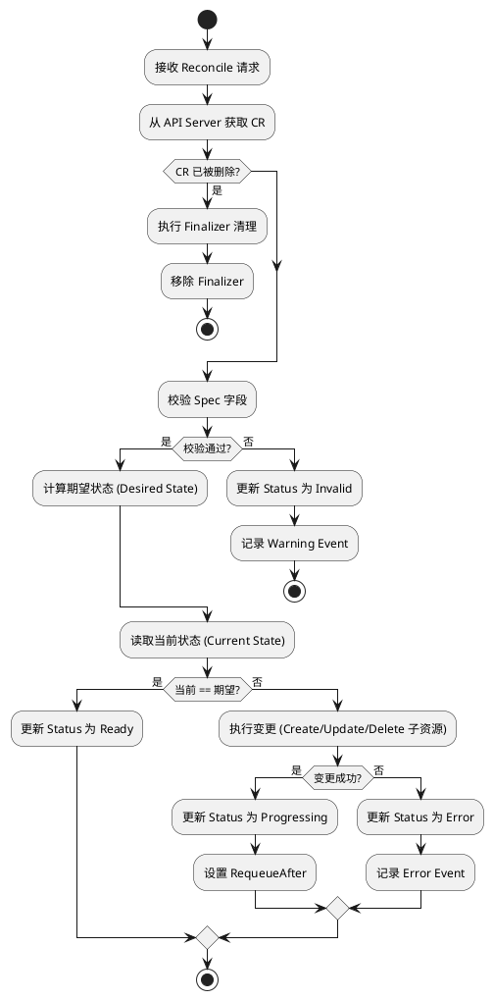
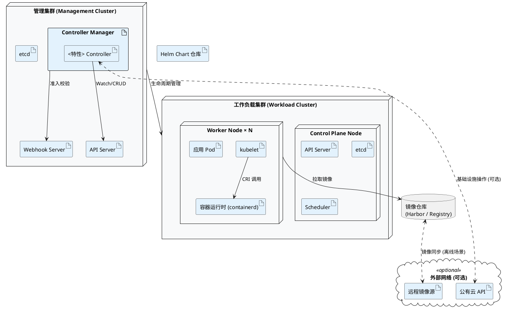

# 4+1 视图 PlantUML 模板

openFuyao 云原生项目方案设计中 4+1 架构视图的 PlantUML 代码模板。
示例以 K8s 云原生场景为背景，根据实际特性替换参与者、组件、流程。

---

## 用例视图（+1 视图）

展示核心参与者和使用场景，回答"系统为谁做什么"。

**编写要点**：

- 参与者区分人类角色与系统角色（用 `<<system>>` 标记）
- 用例命名：动词 + 对象（如"创建自定义资源""配置弹性伸缩策略"）
- 系统边界用 `rectangle` 框定特性范围
- K8s 生态中常见系统角色：API Server、Controller Manager、Scheduler、Kubelet

---

## 逻辑视图

展示模块/包的职责划分与依赖关系，回答"系统由哪些逻辑单元组成"。

**编写要点**：

- 按 K8s 惯例分为 API 层 / 控制面 / 数据面 / 基础设施
- 标注依赖方向（实线=强依赖）和可选依赖（虚线）
- 新增模块用不同背景色标注：`BackgroundColor #E3F2FD`
- 与项目实际包结构对齐（参考项目的架构文档或 README）

---

## 开发视图

展示代码组织、分层与构建单元，回答"代码如何组织"。

**编写要点**：

- K8s Operator 项目常见分层：`api/` → `internal/controller/` → `pkg/` → `cmd/`
- 区分内部包和外部模块（`<<cloud>>` 标记外部）
- 代码生成产物（`zz_generated.`*）标注来源
- 新增文件/包用注释标注 `<<new>>`

---

## 运行视图

展示关键场景的运行时交互时序，回答"组件间如何协作"。

### 模板 A：时序图（适用于 Reconcile 调用链）

### 模板 B：活动图（适用于流程编排）

**编写要点**：

- 每个关键场景（SR 中的 Must 级功能）至少一个时序图
- 标注 `activate`/`deactivate` 显示生命周期
- 错误路径用 `alt`/`else` 分支或活动图 `if` 展示
- K8s 特有模式：Reconcile 循环、Finalizer 清理、Status 更新、Event 记录
- 循环等待/重试用 `loop` 片段

---

## 部署视图

展示物理/逻辑节点、容器与网络拓扑，回答"系统如何部署"。

**编写要点**：

- `node` 对应物理/虚拟主机，`artifact` 对应进程/容器/服务
- K8s 典型拓扑：管理集群 + 工作负载集群，或单集群自管理
- 离线场景下外部网络用虚线 + `<<optional>>` 标注
- 多架构部署标注 `amd64`/`arm64`（如 `node "Worker (arm64)"`）
- 持久化存储标注 `database` 类型

---

## 综合提示

1. **命名一致性**：PlantUML 中的组件名与代码包名、设计文档中的模块名保持一致
2. **颜色语义**：新增组件 `#E3F2FD`（蓝）、修改组件 `#FFF3E0`（橙）、删除组件 `#FFEBEE`（红）
3. **复杂度控制**：单个图不超过 15 个组件/参与者，超出时拆分为子图
4. **语法校验**：输出后建议在 [PlantUML 在线编辑器](https://www.plantuml.com/plantuml/uml) 或 IDE 插件中渲染确认，避免语法错误
5. **MCP 渲染**：实际生成文档时，优先使用 PlantUML MCP 生成 SVG 图片并保存到 `figures/` 目录，详见 [SKILL.md 块 2 的 PlantUML 渲染与存储规范](SKILL.md#块-2-4+1-架构视图)
